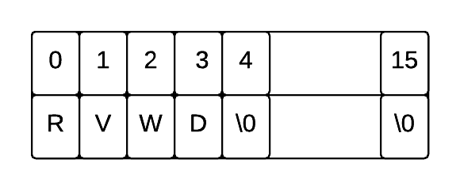
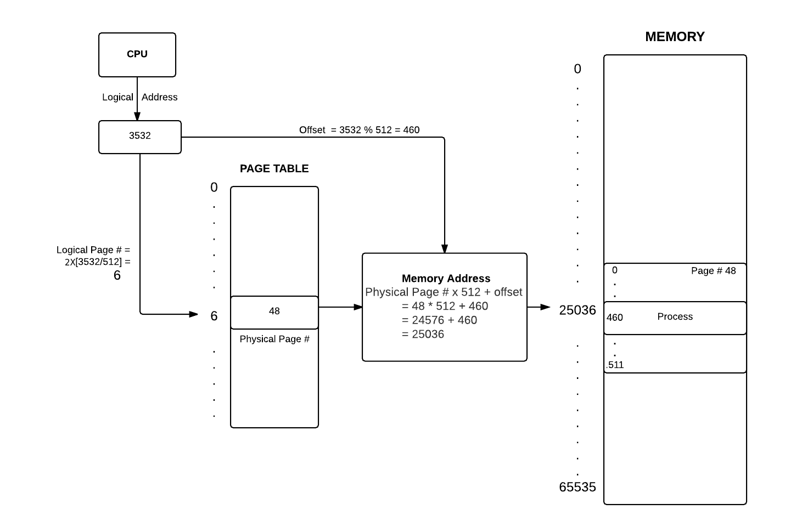

The hardware [paging](http://en.wikipedia.org/wiki/Paging) scheme of XSM maps the virtual address space of a user mode program to the physical address space of the machine. Read the [XSM Virtual Machine Model](../virtual-machine-spec.md) before proceeding further.

  

#### **Page Table**

Every user mode program has an associated page table which maps its virtual address space to the machine's physical address space. For the hardware address translation to work, the base address of the Page Table (of the user mode program currently in execution) must be stored in the Page Table Base Register (**PTBR**) and the number of entries in this Page Table must be stored in the Page Table Length Register (**PTLR**). The page tables must be set up in the **privileged mode**.


  

Each Page Table stores the physical page number corresponding to all the logical pages of a user mode program. The logical page numbers of a user mode program can vary from **0** to **PTLR - 1**. Therefore, each user mode program has a Page Table with PTLR entries.

Each page table entry for a logical page is of **2 words**. The 1st word must be set to the physical page number in the memory where the logical page is actually loaded. In this case, the page table entry is said to be **valid**. If the page has not been loaded into the memory, the page table entry is said to be **invalid**. The 2nd word in a page table entry stores a sequence of flag bits storing information regarding whether the page a) is **valid** or not b) is **read only/read write**, c) has been **referenced** in the user mode after being set to valid and d) has been **modified** in the user mode after being set to valid (**dirty**). The layout of this word is given below:



**Reference Bit (R)**: This bit must be initialised to 0 (unreferenced) when a page table entry is initially made valid. On a page access, this bit is set to 1 by the machine hardware i.e, as soon as the page is accessed for the first time, this bit is changed from 0 to 1. Page replacement algorithms of operating systems use this bit.

**Valid/Invalid Bit (V)**: This bit indicates whether the entry of the page table is valid or invalid. The Valid/Invalid bit must be set to 1 if the first word of this entry corresponds to a valid physical page number. Its value is set to 0 if the entry is invalid. The Valid/Invalid bit is set by the application, typically the operating system. If memory access is made to a page whose page table entry is invalid, the machine transfers control to the [Exception Handler routine](../os-design/exe-handler.md).

**Write Permission Bit (W)**: This bit must be set to 1 if the user mode program is permitted to write into the page, otherwise it must be set to 0. If a user mode program tries to modify a page whose Write Permision bit is set to 0, the machine transfers control to the [Exception Handler routine](../os-design/exe-handler.md).

**Dirty Bit (D)**: This bit is set to 1 by the machine if an instruction modifies the contents of the page.

  
  

#### **Address Translation Scheme**

The addresses generated by the machine while executing in user mode are logical addresses. The paging hardware translates these addresses to physical addresses as described below.

Address translation is done using the Page Table. Logical address/512 gives the logical page number which is the index of the page table entry for the logical page in the page table. Since each page table entry has 2 words, multiplying the logical page number by 2 and adding the base address of the page table given in the PTBR to it gives the location of the page table entry corresponding to the given logical address.

**Location of page table entry = PTBR + 2 x (Logical Address / 512)**

The value stored in the 1st word in the page table entry corresponds to the physical page number.

**Physical Page Number = \[ Location of page table entry \]**

Offset into the page is calculated as

**offset = Logical Address % 512**

The physical address is computed by multiplying the physical page number by page size (=512) and adding the offset.

**Physical Address = Physical Page Number x 512 + offset**

  
  
  
  

#### Example

Assume the per-process page table is as shown below:

| Physical Page Number | Auxiliary Information (R,V,W,D) |
| -------------------- | ------------------------------- |
| 19                   | 0110                            |
| 20                   | 0110                            |
| -1                   | 0000                            |
| -1                   | 0000                            |
| 57                   | 1111                            |
| 72                   | 1110                            |
| 48                   | 1111                            |
| -1                   | 0000                            |


##### Example 1

Given a logical address of 3532, the translation occurs as follows:
```
Logical page number = index of page table entry   /* index starts from 0 */
                    = 3532/512 = 6

Location of page table entry = PTBR + 2 * 6

Physical Page Number = [PTBR + 2 * 6 ] = first word of the 7th entry in page table = 48

Offset = 3532%512 = 460

Physical Address = 48 * 512 + 460 = 25036
```

##### Example 2

Suppose the machine runs in user mode with IP register pointing to the virtual address 40, and this memory contains the machine instruction  
MOV R0,\[1032\]. Memory address 1032 will be resolved as follows:

Logical page number = 1032/512 = 2

Since the valid bit is set to 0, in the page table, the page is not physically present in the memory. Hence, the hardware will generate a page fault exception with the exception flag registers set as the following:

EIP : 40 (Virtual IP address), EPN: 02 (exception page number), EC: 0 (exception cause - page fault), EMA: 1032.