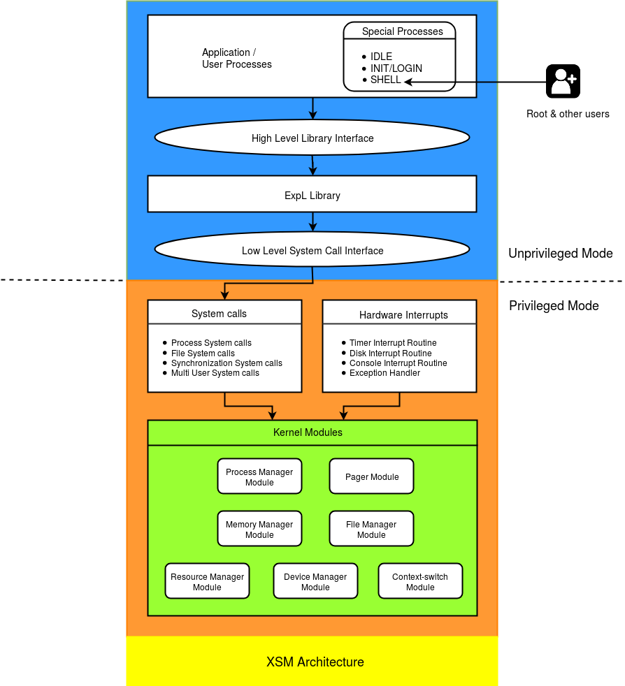

---
hide:
    - navigation
    - toc
---
# eXpOS NITC

    <h5>Project Infomation:</h5>
    

    Source Code:
    <a href="https://github.com/exposnitc">https://github.com/exposnitc</a>
     
    Contact:
    <a href="https://groups.google.com/g/xos-users">Google Group</a>
     
    Trial version, errors are being corrected as reported.
     
    Last updated: 5th April 2021 (see <a href="/changelog/">Release Notes</a>) 
    

Project eXpOS (eXperimental Operating System) is an on-line educational platform which helps undergraduate students to learn the working on an operating system. A detailed project roadmap that is part of the platform provides step by step guidance to the student towards writing a small operating system from scratch. The student learns the implementation of various OS data structures and kernel routines during the course of the project. The OS written by the student will run on a machine simulator supplied along with the platform. The project assumes that the student has undergone a course in computer organization, and is comfortable with programming.

## Roadmap
If you wish to work on the project, the approach we suggest is to follow the project roadmap. The roadmap takes you through a step by step journey towards the complete implementation of the operating system. At each step, you will be asked to read concepts, specifications and interfaces that are required for that step. In fact, you will be asked to read only what is necessary for completing that step. The links to the relevant reading material will be given at appropriate places in the roadmap.

[Proceed to Roadmap :material-road:](./roadmap/){ .md-button .md-button--primary  target=_blank}

## Final System
{ align=left }
If you are curious about what the "final system" you are going to build looks like, we give a brief overview here. You are warned not to get lost in the links. The roadmap will ask you to read the appropriate parts of the documentation as and when required. 

In the figure, an architecture simulator for the eXperimental String Machine (XSM) is given to you. Your primary job is to implement the eXpOS kernel for this machine in such a way that application programs can be loaded and executed by your kernel. You will also be asked to write a few application programs,­ like the shell (for providing a user interface).

Clearly, in order to write the OS kernel, one must be given its two interfaces – the interface to the architecture below and the interface to the executable application programs above. The former is given to you in the [XSM architecture](arch-spec.md) specification. The latter, called the [Application Binary Interface](abi.md) specification, is also given to you. There are also two additional interfaces (not shown in the figure) described below:
    
1. The format in which data and executable files are stored in the disk is standardized and given in the [eXpFS file system specification](os-spec/expfs.md). This standardization allows portability of files between eXpOS and other systems. You must implement the OS file system satisfying this interface specification.
2. Specification for a small application layer software called the [eXpOS Library](os-spec/misc.md/#expos-library) is given to you. The library is a special application program that stands between the OS kernel and other application programs. The library provides a generic interface through which other applications can access the OS system calls. Dynamic memory management services of the OS are also implemented by the library. The library code will be supplied to you. Your OS kernel must load the library into memory and link it to the application programs at run time.

Since you start with a bare machine with no software on it, you need some external mechanism to:

1. Write the kernel modules and get them as XSM executable programs.
2. Store these modules into the machine's disk so that they can be loaded to the memory and executed when the machine is powered on.

We provide you with support tools for achieving the above objectives.

For the first task, a cross compiler for an enriched XSM assembly language called the [System Programming Language (SPL)](support-tools/spl.md) is given to you. You can write the OS modules in the SPL language from your host (Linux/Unix) environment and generate XSM target programs using the SPL compiler.

For the second task, we provide you with an interface software called the [XFS interface](support-tools/xfs-interface.md).This tool allows you to transfer executable kernel modules from your host (Linux/Unix) system to specified blocks of the XSM disk. Thus, you can load the XSM target modules into the appropriate areas of the XSM disk.

The following figure illustrates the OS development environment from an OS programmer's viewpoint.
{ style="display:block; margin-left: auto; margin-right: auto; width: 50%;" }

A similar mechanism is provided for preparing application programs and loading them to the machine's disk. A cross compiler for a tiny high level programming language called the [Experimental Language (ExpL)](support-tools/expl.md) is supplied to you. The ExpL compiler translates your program into the target executable format recognized by eXpOS. These programs can be stored in the XSM machine's disk using the XFS interface tool.

The following figure illustrates the development environment from an application programmer's perspective.
{ style="display:block; margin-left: auto; margin-right: auto; width: 50%;" }

The OS that you build will be very elementary. There will be no system software like compilers or file editors that run on top of the OS. **The OS will only be capable of loading into the memory and executing programs that are already pre-loaded into machine's disk before boot up.** Hence, the only way to write application programs (or kernel code) for the OS will be to write the code from your host (Linux/Unix) system, compile the code using ExpL (or SPL) cross compiler and pre-load the target executable into the XSM disk using the XFS-Interface tool, before powering on the simulator. 

Once the OS modules and application programs are loaded into the XSM machine's disk, the [XSM simulator](support-tools/xsm-simulator.md) can be used to bootstrap the OS into the machine memory and start execution.

The collection of development tools given to you including the XSM simulator, compilers for ExpL and SPL and XFS Interface will be referred to as the "eXpOS package” in the eXpOS documentation.

The following figure gives a high level picture of the OS that you will build by the end of the project.

{ style="display:block; margin-left: auto; margin-right: auto; width: 50%;" }

The [eXpOS specification](os-spec.md) provides an informal description of OS from the view point of the user/application programmer. You may also have a quick look at the high level system design for a closer view of the OS.

eXpOS evolved from a primitive version called [XOS](http://xosnitc.github.io/) developed a few years back. The eXpOS [FAQ](faq.md) and [About us](about.md) pages provide some more information.

We wish you enjoy doing the project following the [Roadmap :material-road:](roadmap.md).