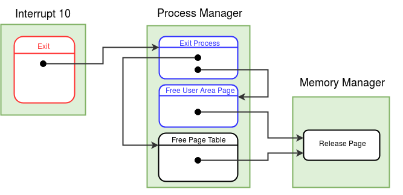

### Arguments
None

### Return Value
None

### Description
Exit system call terminates the execution of the process which invoked it and destroys its memory address space. The calling application ceases to exist after the system call and hence the system call never returns.

Data structures modified are [Memory Free List](mem-ds.md#mem_free_list), [Disk Free List](disk-ds.md#disk_free_list), [Open File Table](mem-ds.md#file_table), [Semaphore Table](mem-ds.md#sem_table), [System Status Table](mem-ds.md#ss_table), [Resource Table](process-table.md#per_process_table) and the [Disk Map Table](process-table.md#disk_map_table).

Control flow diagram for *Exit* system call
  

### Algorithm

<pre><code>
Set the MODE_FLAG in the <a href="../../os-design/process-table/">process table</a> entry to 10.

//Switch to the Kernel Stack. see <a href="../../os-design/stack-smcall/">kernel stack management during system calls</a>
Save the value of SP to the USER SP field in the <a href="../../os-design/process-table/">Process Table</a> entry of the process.
Set the value of SP to the beginning of User Area Page.

Invoke the <b>exit_process()</b> function from the <a href="../../modules/module-01/">Process Manager</a> module.

/* exit_process() releases all the memory pages of the process including the page holding kernel stack.
Still, as exit_process is non-blocking, the kernel stack page will not be allocated to another process.
This makes it possible to make a final call from the process to the scheduler. There is no return to
the process after the following scheduler invocation. */ 

Invoke the <b>context_switch()</b> function in the <a href="../../modules/module-05/">Scheduler Module</a>.
	
</code></pre>  