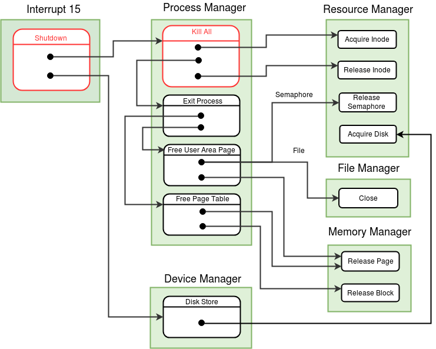

### Arguments
None

### Return Value
-1 on error or NIL

### Description
The shut down system call is used to halt the system. It can be invoked only from shell of the root user. It terminates all the running processes, commits back the disk data (inode table, disk free list, root file, user table and dirty disk buffers) and halts the system.

Control flow diagram for *Shutdown* system call

### Algorithm

<pre><code>  
Set the MODE_FLAG in the <a href="../process-table/">process table</a> entry to 21, 
indicating that the process is in the shutdown system call.
	
//Switch to the Kernel Stack. see <a href="../stack-smcall/">kernel stack management during system calls</a>
Save the value of SP to the USER SP field in the <a href="../process-table/">Process Table</a> entry of the process.
Set the value of SP to the beginning of User Area Page.

If the current process is not the shell, return -1.	/* Shell process has the PID 2 */
If the current user is not the root, return -1.

Kill all user processes except the idle, login and the current process(shell) by calling the 
<b>kill_all()</b> function in the <a href="../../modules/module-01/">Process Manager</a> module.

Loop through the <a href="../mem-ds/#buffer-table">Buffer Table</a>
	If the buffer is dirty
		Commit changes to the disk by calling the <b>disk_store()</b> function in the <a href="../../modules/module-04/">Device Manager</a> module.

Commit the inode table, root file, user table and disk free list to the disk by calling the 
<b>disk_store()</b> function in the <a href="../../modules/module-04/">Device Manager</a> Module.

Halt the system.
</code></pre>  